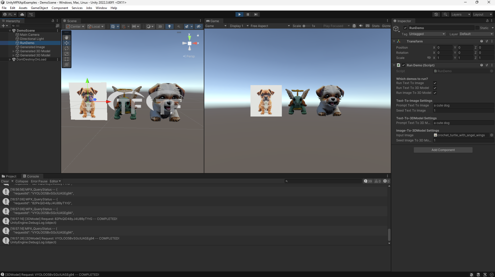
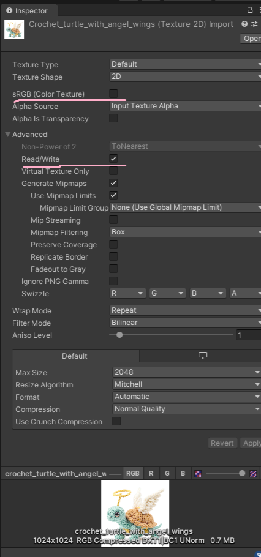

# UnityMPXApiExamples
This repo is a [Unity](https://unity.com/) project which contains scripts that connect with the [Masterpiece X](https://www.masterpiecex.com/) [API](https://developers.masterpiecex.com/) to generate images and 3D models using generative AI at runtime.

Tested with Unity version `2022.3.60f1`

# Quickstart
1) Follow the [getting-started guide](https://docs.masterpiecex.com/docs/getting-started) on the [Masterpiece X API documentation website](https://docs.masterpiecex.com/) to ensure you have a developer account setup with credits and an API key.
2) Clone this repo.
3) Open the project via Unity Hub using 'Add project from disk'.
4) Open the `DemoScene` located under `Assets/Scenes`
5) Update the variable `MPXSecretToken` (on line 40) in the script `RunDemo.cs` (located under the `Assets` folder) with your own API key that you should have obtained from Step #1.
6) Hit play and wait for the generations to pop-up. It should take ~2 mins to generate everything but exact runtime will depend on server load. See below for example output after the generations are completed.

# How it works
At a high level we utilize the [RestClient](https://github.com/proyecto26/RestClient) library to make REST API calls to the [MPX endpoints](https://docs.masterpiecex.com/reference). Generated images are downloaded and displayed as a textured quad using native `UnityWebRequest`. Generated 3D models are downloaded and displayed using [glTFast](https://github.com/atteneder/glTFast).

# Gotcha's and other notes
Make sure to use linear colorspace (instead of the default sRGB) and enable the Read/Write option when using `Texture2D` imports as images for 3D model generation. If sRGB is enabled then your models will appear darker than expected. See image below for the specific settings in the Unity inspector.

# License
This repository is available under the [MIT](https://github.com/withmpx/UnityMPXApiExamples/blob/main/LICENSE) License.